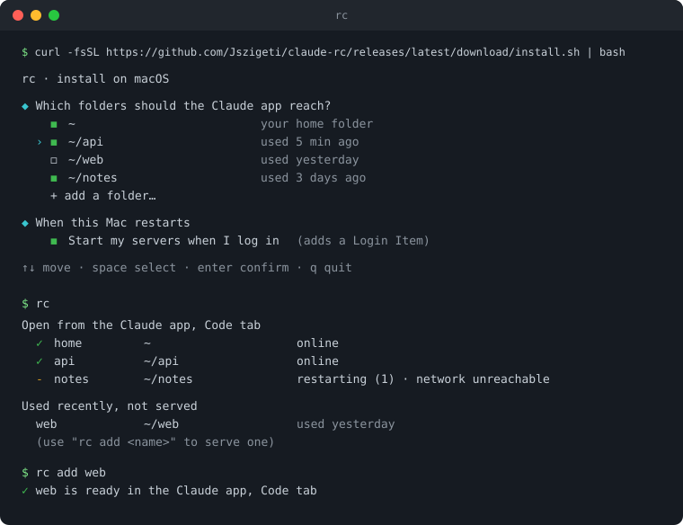

# claude-rc

**Your own Claude Code cloud.**

Serve your projects from your laptop or a server, and start sessions on them from the Claude app, anywhere.

[](https://github.com/Jszigeti/claude-rc/actions/workflows/ci.yml)
[](LICENSE)




## Why

`claude remote-control` lets the Claude app drive a session on your machine. But it serves a single folder, needs a terminal left open, and stops after 10 minutes offline or at the next reboot.

rc keeps one server per project you pick, starts them at login and restarts them when they stop. Your projects wait in the app's Code tab with a green dot. Put it on a server and you get a Claude Code that is always on, on hardware you own.

## Install

```bash
curl -fsSL https://github.com/Jszigeti/claude-rc/releases/latest/download/install.sh | bash
```

You need Claude Code logged in with a claude.ai account (Pro, Max, Team or Enterprise). The installer adds tmux if it is missing (Homebrew, apt, dnf or pacman), then asks two things on one screen: which folders the Claude app should reach, and whether your servers start on their own when you log in.

Piping curl into bash deserves a look first: [install.sh](install.sh) is the whole installer, and ending the line with `| bash -s -- --dry-run` shows what it would do without changing anything.

On a server, log in once over SSH with `claude auth login`: open the link it prints on any device, then paste the code back.

## Use

From the app, in a session, type the exact command:

| Command | Effect |
| --- | --- |
| `rc` | starts what is missing, lists the servers and folders worth serving |
| `rc add <folder or name>` | serves a folder (a path, or just its name, like `rc add web`), or restarts a served one |
| `rc rm <name or folder>` | stops a server and forgets its folder |

Each served folder shows up in the app with a first session that Claude Code creates for it. Use it like any other, or archive it once and it won't come back. Either way, the sessions you open keep surviving restarts.

rc answers `y` to the trust prompt of the folders you serve, and only those: anyone with access to your Claude account can run commands there.

## How it works

- `~/.config/rc/folders` holds one `name=path` line per served folder.
- A dedicated tmux server, `tmux -L rc`, runs one session per folder. Each one restarts `claude remote-control` 60 s after it stops, and waits without restarting while the login is expired.
- After 8 minutes offline, rc stops the server itself. Claude Code would give up at 10 minutes and drop the folder's environment and sessions, while a server stopped by rc keeps them for when the network is back.
- At login, a LaunchAgent starts rc on macOS, a systemd user unit on Linux and WSL. On WSL, a Windows scheduled task also keeps the distro alive.

## Uninstall

```bash
curl -fsSL https://github.com/Jszigeti/claude-rc/releases/latest/download/install.sh | bash -s -- --uninstall
```

Your folders stay listed in `~/.config/rc/folders`.

## Limits

- A sleeping machine is unreachable until it wakes up.
- A frozen but living server is not detected: `rc add <name>` restarts it.
- A server restarted more than 4 h after it stopped leaves an old environment in the app.
- WSL: the scheduled task may leave a console window open.
- Linux without systemd (Void, Alpine, Gentoo with OpenRC…) is not supported.
